Sistem sederhana untuk manajemen event kampus dan pendaftaran peserta.

## Fitur
- CRUD Event (hanya admin dgn auth)
- Pendaftaran peserta ke event (dengan pengecekan kuota)
- Frontend HTML sederhana
- Dokumentasi otomatis via Swagger

## Admin Token
Gunakan header: `x-token: santo_admin` untuk akses admin.

## Instalasi

1. Jalankan perintah:

   ```bash
   pip install -r requirements.txt
   ```

2. Jalankan aplikasi:

   ```bash
   uvicorn main:app --reload
   ```

3. Buka:

   * **API DOCS:** [http://localhost:8000/docs](http://localhost:8000/docs) (sebagai admin)
     *(Klik tombol "TRY IT OUT" untuk menjalankan fungsi)*

     * **Cek Koneksi ke Index**

       * `GET /` → **Execute**

     * **Tambah Event**

       * `POST /events`
       * Isi header `x-token`
       * Isi body JSON → **Execute**

     * **Cek Event**

       * `GET /events` → **Execute**

     * **Update Event**

       * `PUT /events`
       * Isi ID Event
       * Isi header `x-token`
       * Isi body JSON → **Execute**

     * **Delete Event**

       * `DELETE /events` *(CASCADE: saat dihapus maka peserta yang terdaftar akan ikut terhapus)*
       * Isi ID Event
       * Isi header `x-token` → **Execute**

     * **Register Peserta Manual**

       * `POST /register`
       * Isi body JSON → **Execute**

     * **Cek Peserta**

       * `GET /participants` → **Execute**

   * **Frontend:** [http://localhost:8000/static/index.html](http://localhost:8000/static/index.html)

     * Dapat melihat event yang tersedia
     * Isi form → klik **"Daftar Sekarang"**
     * Lihat pesan sukses/error

## HASIL UJI COBA
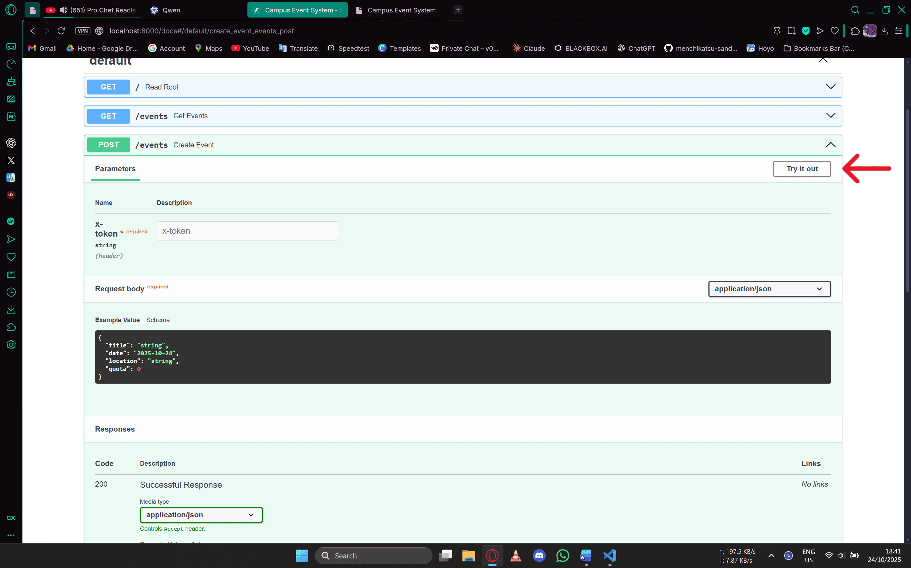
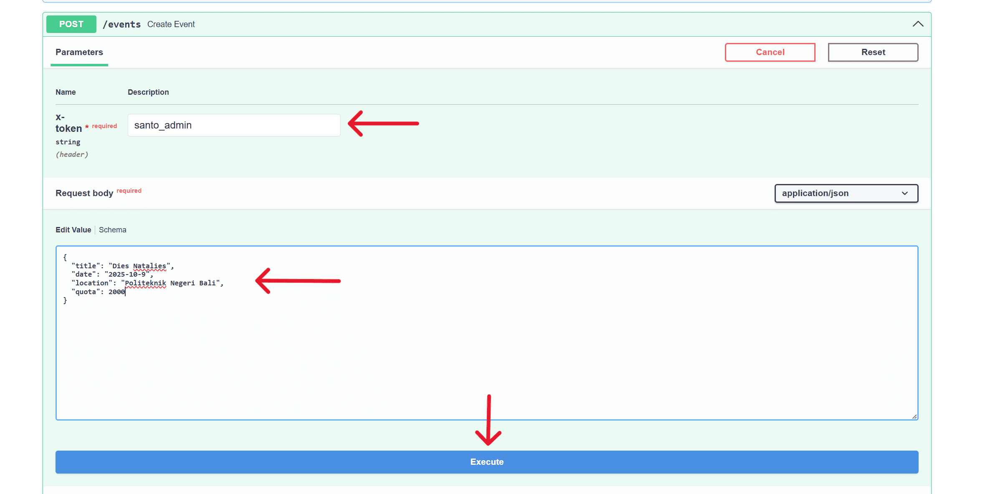
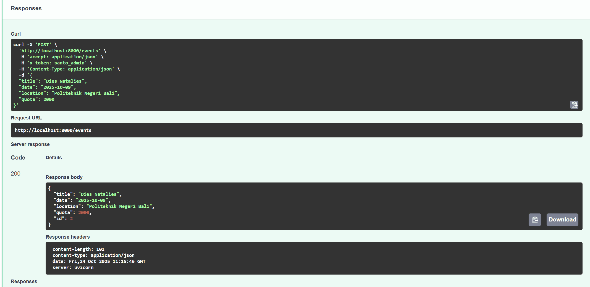
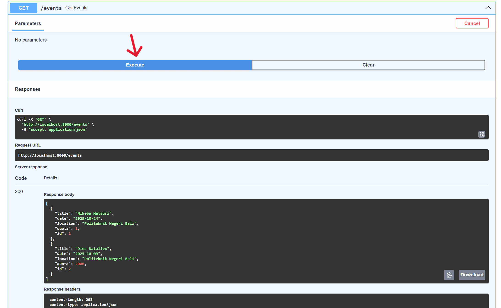
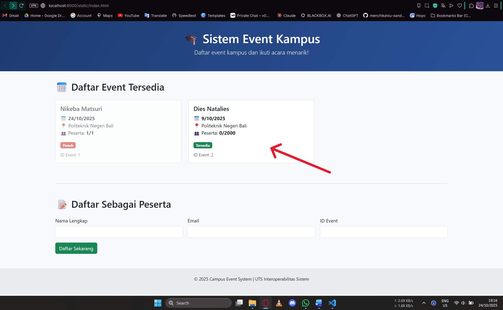
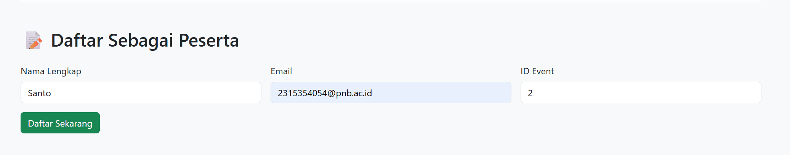
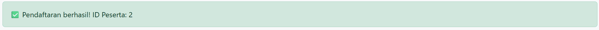
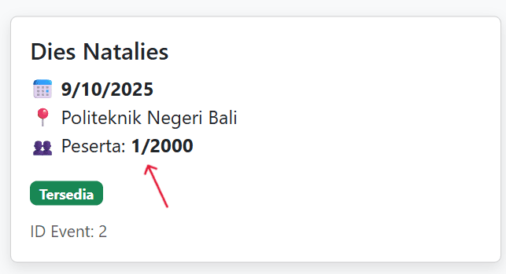
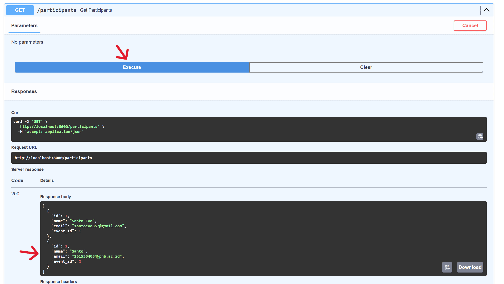
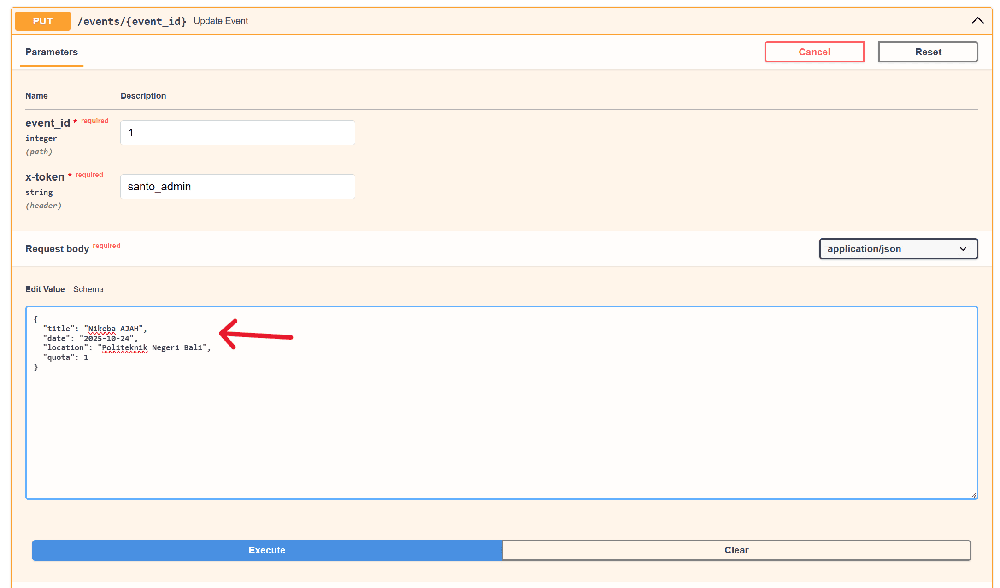
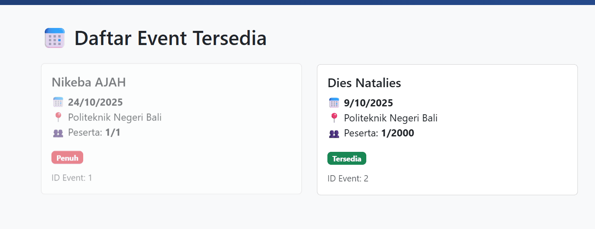
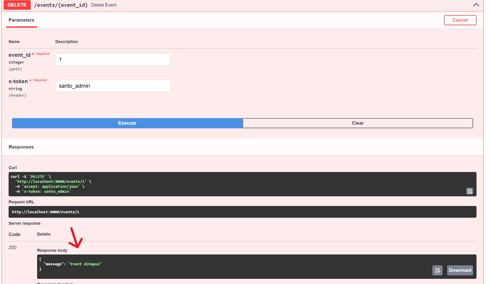
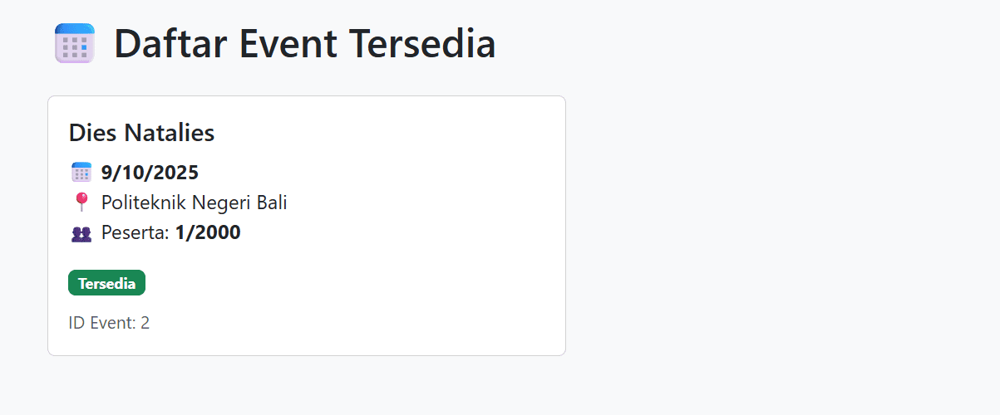
